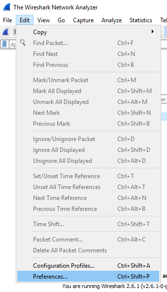
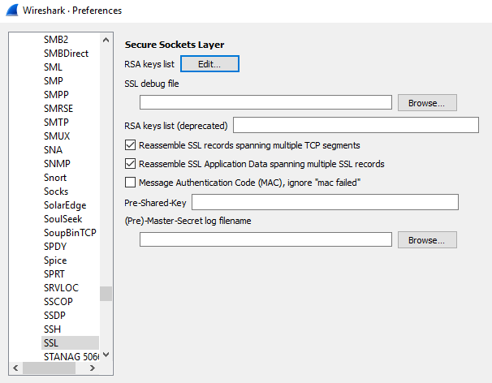
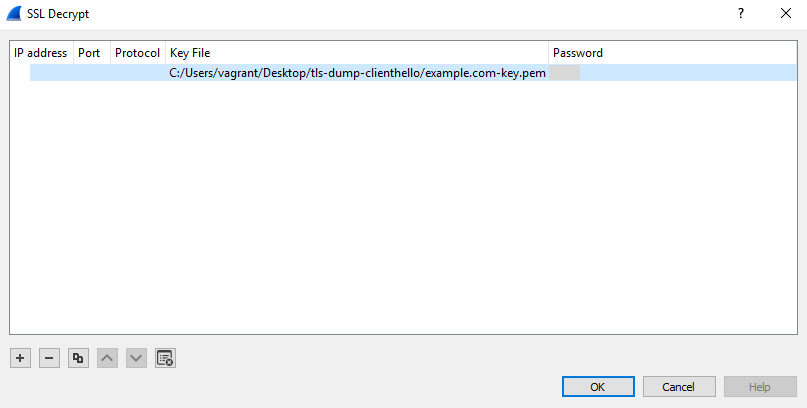
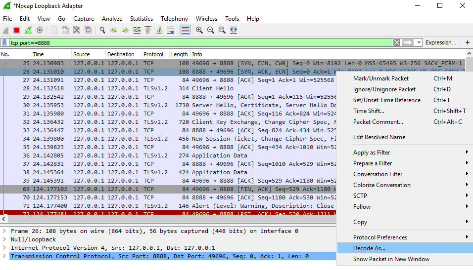
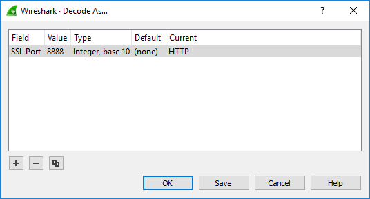
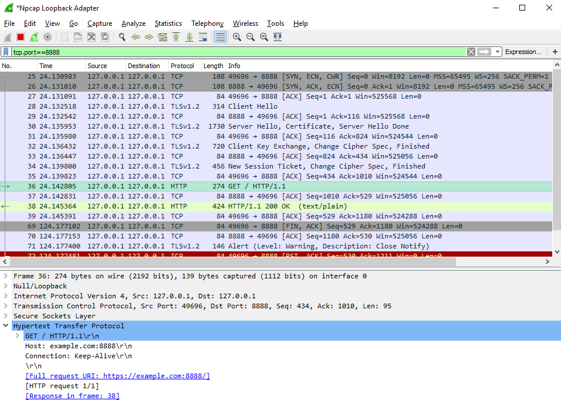

This is a SSL/TLS troubleshooting [Vagrant](https://www.vagrantup.com/) Environment.


# Usage

Install the [Windows 2016 Base Box](https://github.com/rgl/windows-2016-vagrant).

Install the needed plugins:

```bash
vagrant plugin install vagrant-reload   # see https://github.com/aidanns/vagrant-reload
```

Then start this environment:

```bash
vagrant up
``` 

After the environment is installed, login into desktop, and wait a bit until it configures the Desktop.

Install npcap (the setup is in the Desktop).

# Decrypting an HTTPS request

1. Start Wireshark and open the preferences window:

    

1. Select the `SSL` `protocol` on the left tree control, then click the `RSA keys list` `Edit` button:

    

1. Add the server private key files in `PEM` (a `.pem` file) or `PKCS#12` (a `.p12`/`.pfx` file) format:

    

    **NB** to add more keys, click the plus button that is on the bottom left corner of the window.

1. Click the `OK` buttons.

1. Start a capture in the `Npcap Loopback Adapter`.

1. Start the HTTPS server `C:\Users\vagrant\Desktop\tls-dump-clienthello\tls-dump-clienthello.exe`.

1. From a new PowerShell session, run the following snippet:

    ```powershell
    [Net.ServicePointManager]::SecurityProtocol = [Net.SecurityProtocolType]::Tls12
    (New-Object Net.WebClient).DownloadString("https://example.com:8888")
    ```

1. In Wireshark, apply the `tcp.port==8888` view filter.

1. Right-click a packet that comes from the server (source port is `8888`) and select the `Decode As...` menu item.

    

1. Configure it as:

    

1. Click `OK`.

1. You should now see the decrypted HTTP transaction:

    

**NB** You can only decrypt SSL sessions that use the RSA key-exchange. This works on this vagrant environment because [Schannel](https://docs.microsoft.com/en-us/windows/desktop/secauthn/secure-channel) was configured as such at [provision-iiscrypto.ps1](provision-iiscrypto.ps1).


# Filters

* `ssl.handshake.type==1`: ClientHello
* `ssl.handshake.type==2`: ServerHello
* `ssl.handshake.extensions_server_name`: all handshakes that use Server Name Indication (SNI).
* `tcp.analysis.flags`: tcp analysis.


# Reference

* [Wireshark SSL preferences](https://wiki.wireshark.org/SSL#Preference_Settings).
* [SSL/TLS Decryption: Uncovering Secrets (Peter Wu) (video)](https://www.youtube.com/watch?v=bwJEBwgoeBg) and [Slides from a previous presentation](https://sharkfesteurope.wireshark.org/assets/presentations17eu/15.pdf).
* [TCP Analysis (Jasper Bongertz) (video)](https://www.youtube.com/watch?v=Tz6IfyfodKo)
